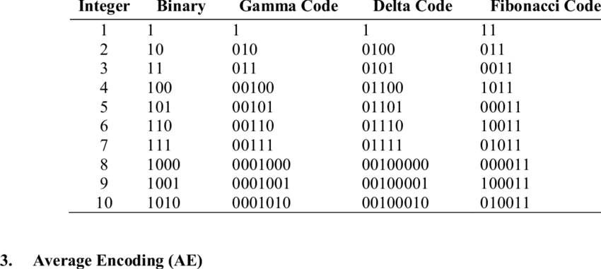

## Bonus Compression Elias-Gamma

Coding $\gamma$ untuk suatu bilangan bulat positif $k$ terdiri dari dua komponen:

- Sektor;
- Body;

Untuk mengencode:

- Cari nilai terbesar dari $N$, sehingga $2^N \leq X$, dengan kata lain, kita mencari Most significant bit dari $X$, kemudian kita akan melakukan encoding bilangan $N$ menggunakan unary coding, itu untuk bagian sectornya. Unary coding untuk suatu bilangan $N$ merupakan $N -1$ buah $0$ diikuti dengan satu buah bit $1$. 

- Bagian sisanya, yaitu $X - 2^N$, direpresentasikan dengan binary, yaitu bagian bodynya. 

- Bagian sector pada intinya sama seperti penunjuk size dari bilangannya, sehingga nanti cara bacanya tinggal 

- kira-kira:

  ```
  while(*bit != 1) len++
  bilangan++
  while(len--) bilangan <<= 1, bilangan += bit
  ```

Misal bilangan $7 = \textcolor{red}{2^2} + \textcolor{blue}{3} = \textcolor{red}{001}\textcolor{blue}{11}$



Untuk benchmarking didapatkan hasil:


| Compression Method            | Waktu Rata-Rata Indexing | Waktu Rata-Rata Searching | Ukuran Dictionary | Ukuran Index |
| ----------------------------- | ------------------------ | ------------------------- | ----------------- | ------------ |
| Standard (Tidak ada kompresi) | 0.39821 detik            | 0.40845                   | 75 KB             | 340.5 KB     |
| Variable Byte Encoding        | 0.47410 detik            | 0.48441 detik             | 66.01 KB          | 48.56 KB     |
| Elias Gamma                   | 0.57993 detik            | 0.59071 detik             | 66 KB             | 41.704 KB    |

Dari sini kita mengetahui bahwa terdapat trade off waktu dan memori dari beberapa teknik kompresi yang dilakukan, dengan pencarian dilakukan 10 kali untuk query:

```python
queries = ["olahraga", "tumor", "hidup sehat", "jantung", "penyakit",
               "kuat", "badan sehat", "olahraga teratur", "tidur cukup"]
```

Serta dilakukan indexing 10 kali pula untuk masing-masing teknik kompresi.